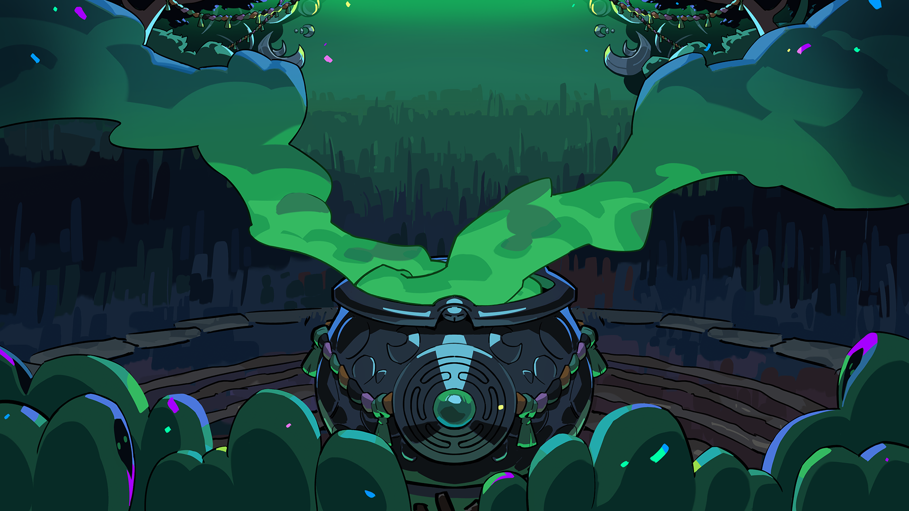

# Hades 2 Build Planner

A modern, intuitive build planner for Hades 2 that helps you theorycraft, optimize, and share devastating builds. Plan your weapons, charms, and boons to dominate your next run through the underworld.



## ✨ Features


- **🛡️ Complete Database** - Access every weapon, boon, upgrade, and aspect in Hades 2
- **📤 Easy Sharing** - Share builds with a single link or export to images
- **⚡ Lightning Fast** - Built with modern tech for instant loading
- **👥 No Account Required** - Use almost all features without signing up
- **🎨 Beautiful Interface** - Gorgeous, intuitive design that works on any device

## 🚀 Quick Start

### Prerequisites

- [Bun](https://bun.sh) (recommended) or Node.js 18+
- PostgreSQL database

### Installation

1. **Clone the repository**
   ```bash
   git clone https://github.com/hezaerd/hades2builder.git
   cd hades2builder
   ```

2. **Install dependencies**
   ```bash
   bun install
   ```

3. **Set up environment variables**
   ```bash
   cp .env.example .env.local
   ```
   Fill in your database URL and other required environment variables.

4. **Set up the database**
   ```bash
   bun run db:migrate
   bun run db:generate
   ```

5. **Start the development server**
   ```bash
   bun run dev
   ```

6. **Open your browser**
   Navigate to [http://localhost:3000](http://localhost:3000)

## 🛠️ Tech Stack

- **Framework**: Next.js 15 with App Router
- **Language**: TypeScript
- **Styling**: Tailwind CSS
- **Database**: PostgreSQL with Prisma ORM
- **Authentication**: Better Auth
- **UI Components**: Radix UI + shadcn/ui
- **State Management**: Zustand
- **Animations**: Framer Motion
- **Package Manager**: Bun

## 🎮 How to Use

1. **Start Building** - Click "Start Building" to access the build planner
2. **Select Your Setup** - Choose weapons, charms, and boons
3. **Optimize** - Use the smart suggestions to find powerful combinations
4. **Share** - Export your build or share with a link
5. **Join Community** - Connect with other builders on Discord

## 🤝 Contributing

We welcome contributions! Please see our [Contributing Guidelines](CONTRIBUTING.md) for details.

1. Fork the repository
2. Create a feature branch (`git checkout -b feature/amazing-feature`)
3. Commit your changes (`git commit -m 'Add amazing feature'`)
4. Push to the branch (`git push origin feature/amazing-feature`)
5. Open a Pull Request

## 📝 License

This project is licensed under the GNU Affero General Public License v3.0 - see the [LICENSE](LICENSE) file for details.

## 🙏 Acknowledgments

- Supergiant Games for creating the amazing Hades 2
- The Hades community for inspiration and feedback
- All contributors who help improve this tool

## 📞 Support

- **Discord**: [Join our community](https://discord.gg/CG6CJRkcdm)
- **Issues**: [GitHub Issues](https://github.com/hezaerd/hades2builder/issues)

---

**Happy planning! 🔥⚔️**